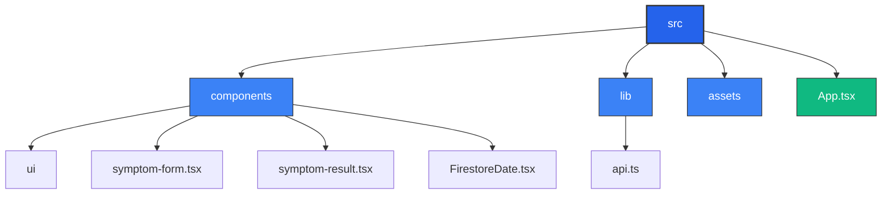

# ROMI Express - Sistema de Diagnóstico Médico

  

Sistema automatizado para evaluación de síntomas médicos y generación de recomendaciones preliminares.

---

## 🚀 Características Principales

- 📋 Formulario interactivo para registro de síntomas  
- 📊 Escala visual de dolor (1-10) con retroalimentación inmediata  
- ⚠️ Detección de casos que requieren atención urgente  
- 📑 Historial de pacientes registrados  
- 📱 Diseño responsive (mobile-first)  

---

## 🛠️ Tecnologías Utilizadas

Las tecnologias usadas fueron cuidadosamente seleccionadas para garantizar rapidez, escalabilidad y una excelente experiencia de usuario en el desarrollo de ROMI Express:

- ⚛️ React 18 + TypeScript → Base del frontend que combina la flexibilidad de React con la robustez de TypeScript, asegurando tipado estricto, menos errores y un flujo de desarrollo más confiable.

- 🎨 Tailwind CSS → Framework de estilos utilitario que permite construir interfaces modernas, responsivas y consistentes de manera ágil, manteniendo el código limpio.

- ✨ Lucide React + FontAwesome → Librerías de iconos ligeras y personalizables que mejoran la accesibilidad y refuerzan la comunicación visual de la aplicación.

- ⚡ Vite → Bundler ultrarrápido que acelera la compilación y el hot-reload, optimizando tanto la experiencia de desarrollo como el rendimiento en producción.

- 🔥 Firebase → Utilizado para la persistencia de datos y autenticación, ofreciendo una solución en la nube escalable, segura y en tiempo real sin necesidad de configurar servidores complejos.

- 🌐 Express → Framework minimalista para el backend que gestiona las rutas y la comunicación entre el cliente y el servidor de manera eficiente.

- 🟩 Node.js → Entorno de ejecución que permite crear un backend rápido y no bloqueante, ideal para aplicaciones con necesidades de tiempo real.

- 💻 JavaScript → Lenguaje base del proyecto, universal y versátil, que garantiza compatibilidad y una amplia comunidad de soporte.

- 🎛️ Shadcn → Sistema de componentes modernos y accesibles que, junto con Tailwind, permite construir interfaces limpias, coherentes y altamente personalizables.

En conjunto, este stack proporciona un balance entre desarrollo rápido, diseño atractivo y capacidad de escalar hacia una aplicación robusta para el sector salud.

---

## 🏗️ Arquitectura del Proyecto

## 📦 Componentes Clave 
### SymptomForm 
- Captura nombre, síntoma y nivel de dolor
- Validación en tiempo real
- Selector de síntomas con búsqueda
- Control deslizable de dolor (1-10)

### SymptomResult 
- Muestra recomendaciones médicas
- Destaca casos urgentes (alerta roja)
- Permite reiniciar el diagnóstico

### App 
- Coordina el flujo de la aplicación
- Gestiona estados globales
- Maneja pantallas de carga

## 📌 Requisitos 
- Node.js 16+
- npm 8+

## ⚙️ Instalación 
- Clonar repositorio este repositorio
- Instalar dependencias: npm install
- Ejecutar en desarrollo: npm run dev
- Construir para producción: npm run build
